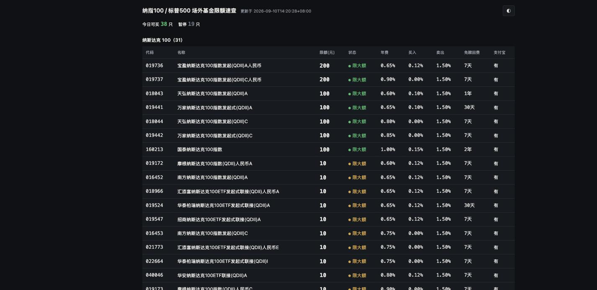

# QDII 场外基金限额速查

> 每日自动追踪纳斯达克 100 与标普 500 **场外**基金的申购限额、申购状态与各项费率。

[](https://github.com/promise96319/qdii/actions/workflows/update.yml)
[](LICENSE)
[](https://www.python.org/)
[](scripts/build.py)

**🔗 线上地址：<https://qdii.qinguanghui.com>** ·
备用 <https://promise96319.github.io/qdii/>



## 这个项目解决什么问题

QDII 基金受外汇额度限制，长期处于限购或暂停申购状态，且**限额逐日变动**——今天能买 100 元，明天可能只剩 5 元，后天干脆暂停。

想定投纳指 100 或标普 500 的人因此每天面临同一个问题：**今天到底能投多少钱？** 只能逐只基金手动翻查，费时且容易漏掉刚恢复申购的品种。

本项目每天自动抓取全市场相关基金的限额与费率，一屏给出答案。

## 特性

- **全市场覆盖** — 自动从 27000+ 只基金中筛出纳指 100 / 标普 500 的人民币场外份额，无需维护白名单
- **每日自动更新** — GitHub Actions 定时抓取，无需人工干预
- **按可投额度排序** — 可申购优先、限额从高到低、同限额比费率，一眼看到今天该买哪只
- **完整费率** — 申购费、赎回费阶梯、免赎回费天数、管理费/托管费/销售服务费
- **支付宝在售标记** — 区分「支付宝可买 / 已暂停 / 不代销」
- **双端适配** — PC 表格 + 移动端卡片流，亮暗双主题跟随系统
- **零运行时依赖** — 抓取脚本仅用 Python 标准库；前端单文件，无框架无构建
- **容错设计** — 单只抓取失败沿用旧值并标记，整体成功率过低则拒绝写入，页面绝不会变成空白

## 限额规则（重要）

这部分是使用本项目的前提，规则来自基金公司公告原文。

**限额按「单日 × 单个基金账户 × 单只基金代码」计算，跨代销渠道合并计算。**

| 维度 | 规则 | 依据 |
|---|---|---|
| 同一代码，跨支付宝 / 微信 / 天天基金 | **合并计算** | 大成公告：「投资人通过**各代销机构**申购本基金 A 类或 C 类份额单日单个基金账户的申购及定期定额投资累计金额应不超过 10 元」 |
| 同一只基金的 A 类与 C 类（不同代码） | **各自独立** | 广发公告：「不同份额的申请将单独计算限额」 |
| 不同基金公司之间 | **完全独立** | 限额由各公司分别公告 |
| 基金公司**直销**渠道 | **单独计额**，通常宽松得多 | 大成同一份公告：直销 100 元 / 代销 10 元 |

**推论：想加大投入应当「换代码」而非「换平台」。** 在两个平台买同一个 6 位代码，超出部分会在 T 日盘后清算时确认失败，超额资金原路退回（约 T+4 到账）；两边金额相同时为随机确认其中一笔。

## 数据说明

### 来源与口径

| 字段 | 来源 | 口径与可靠性 |
|---|---|---|
| 单日限额、申购状态 | 天天基金 | 基金公司公告设定，各代销渠道统一 ✅ |
| 管理费 / 托管费 / 销售服务费 | 天天基金 | 从基金资产每日计提，全平台一致 ✅ |
| 赎回费阶梯、免赎回费天数 | 天天基金 | 基金合同约定，全平台一致 ✅ |
| 申购费**原价** | 天天基金 | 基金公司设定，全平台一致 ✅ |
| 申购费**折后价** | 天天基金 | ⚠️ **平台自定的营销折扣**，支付宝折扣可能不同 |
| 支付宝在售状态 | 蚂蚁基金 | 直接取自支付宝口径 ✅ |

### 排序规则

默认：**可申购优先 → 限额从高到低 → 同限额按年费从低到高 → 代码升序**。

「年费」= 管理费 + 托管费 + 销售服务费，是持有期间每年从基金资产中计提的成本，对长期定投比一次性申购费更重要。表头可点击切换排序键。

### 基金池筛选规则

1. 从全市场基金列表按名称匹配 `纳斯达克100` / `纳指100` / `标普500`
2. 排除纯场内 ETF（代码前缀 `15` / `51` / `52` / `56` / `58`）
   —— **注意 `16` 开头的 LOF 必须保留**，它们场外可申购（如 161130 易方达纳指100、161125 易方达标普500）
3. 排除美元份额（名称含 `美元` / `美汇` / `美钞` / `现汇` / `现钞`）
4. 标记支付宝在售状态（仅标记，不过滤）

## 数据接口

三个公开接口，均无需鉴权。

**基金池全量**
```
GET https://fund.eastmoney.com/js/fundcode_search.js
```
返回全市场基金 `[代码, 拼音, 名称, 类型, 全拼]`。

**限额与费率（主数据源）**
```
GET https://fundmobapi.eastmoney.com/FundMApi/FundRateInfo.ashx
    ?FCODE={code}&deviceid=1&plat=Android&product=EFund&version=6.5.5
```

| 字段 | 含义 |
|---|---|
| `SGZT` | 申购状态：`开放申购` / `限大额` / `暂停申购` |
| `MAXSG` | 单日累计申购限额（元） |
| `MGREXP` / `TRUSTEXP` / `SALESEXP` | 管理费 / 托管费 / 销售服务费（%/年） |
| `sg[]` | 申购费阶梯，`source` 为原价、`rate` 为折后价 |
| `sh[]` | 赎回费阶梯，`time` 为持有期限、`rate` 为费率 |
| `SSBCFMDATA` | 申购确认日 T+N |

**支付宝在售状态**
```
GET https://www.fund123.cn/matiaria?fundCode={code}
```
服务端渲染，正文含 `window.context = {...}`，取 `materialInfo.fundBrief.saleStatus`。

> ⚠️ 同页的 `titleInfo.fundLimit` 恒为 `0--`、`fundBrief.purchaseRatio` 恒为 `--`，均为坏字段，不可使用。

## 数据格式

`data/latest.json`：

```jsonc
{
  "updated_at": "2026-09-10T14:20:28+08:00",
  "date": "2026-09-10",
  "count": 57,
  "funds": [
    {
      "code": "018043",
      "name": "天弘纳斯达克100指数发起(QDII)A",
      "company": "天弘基金",
      "index": "NDX100",            // NDX100 | SP500
      "share_class": "A",           // A/C/D/E/F/I/-
      "status": "限大额",            // 开放申购 | 限大额 | 暂停申购
      "max_buy": 100,               // 单日限额(元)，null = 未披露
      "min_buy": 10,
      "fee_mgmt": 0.50,             // 管理费 %/年
      "fee_trustee": 0.10,          // 托管费 %/年
      "fee_sales": 0.00,            // 销售服务费 %/年
      "fee_annual": 0.60,           // 三项之和，排序主键
      "fee_buy": 0.10,              // 申购费折后价 %
      "fee_buy_original": 1.00,     // 申购费原价 %
      "redeem_free_days": 365,      // 免赎回费天数，null = 无免费档
      "redeem_tiers": [             // 左闭右开：min_days <= 持有天数 < max_days
        { "min_days": 0,   "max_days": 7,    "rate": 1.50 },
        { "min_days": 7,   "max_days": 365,  "rate": 0.50 },
        { "min_days": 365, "max_days": null, "rate": 0.00 }
      ],
      "confirm_days": 2,            // 申购确认 T+N
      "alipay": "正常申购",          // 正常申购 | 暂停销售 | 不可售 | null
      "stale": false                // true = 本次抓取失败，沿用上次数据
    }
  ]
}
```

历史快照按日归档于 `data/history/YYYY-MM-DD.json`。

## 项目结构

```
├── index.html                  # 单文件前端，无框架无构建
├── data/
│   ├── latest.json             # 最新快照
│   └── history/                # 每日归档
├── scripts/
│   ├── build.py                # 主编排入口
│   └── qdii/
│       ├── duration.py         # 中文持有期限 → 天数区间
│       ├── parse.py            # 接口响应 → 基金记录
│       ├── filters.py          # 基金池匹配与过滤
│       ├── alipay.py           # 支付宝在售状态解析
│       ├── sort.py             # 排序比较器
│       ├── merge.py            # 新旧数据合并与写入闸门
│       └── fetch.py            # HTTP 网络层
├── tests/                      # 单元测试 + 真实响应 fixture
├── docs/superpowers/           # 设计文档与实现计划
└── .github/workflows/update.yml
```

架构上刻意把**纯函数**（解析 / 过滤 / 排序 / 合并）与**网络层**分离：前者全部由单元测试覆盖，用真实接口响应存为 fixture；后者只做薄封装，失败返回 `None` 交由调用方降级。

## 本地开发

```bash
git clone git@github.com:promise96319/qdii.git
cd qdii

python3 -m pip install -r requirements-dev.txt   # 仅测试需要
python3 -m pytest tests -q                       # 运行单元测试
python3 scripts/build.py                         # 抓取数据（约 2 分钟）
python3 -m http.server 8000                      # 访问 http://localhost:8000/
```

**抓取脚本 `scripts/build.py` 只用 Python 标准库，运行时零依赖**；`requirements-dev.txt` 中的 pytest 仅供测试。

## 部署

推送到 `main` 即由 GitHub Pages 自动发布（`main` / `(root)`）。

数据更新由 `.github/workflows/update.yml` 驱动，每天 **01:30 UTC（北京时间 09:30）** 运行，也支持在 Actions 页面手动触发。工作流会先跑测试再抓数据，数据无变化时跳过提交。

> 仓库根目录的 `CNAME` 文件是自定义域名的绑定凭据，**请勿删除**。

## 已知限制

1. **支付宝的申购费折扣无法获取** —— 页面展示的折后价是天天基金口径。两者通常同为 1 折，但无法自动验证。
2. **不覆盖微信理财通** —— 无公开查询接口，页面不作任何微信口径声明。
3. **代销机构可在基金公司额度之上自行收紧**（不可放宽）—— 实践中少见，若发生则页面显示的限额会高于实际。
4. **数据为每日快照，非实时** —— 基金公司盘中临时调整限额，需次日才反映。
5. **依赖非官方接口** —— 东方财富与蚂蚁的接口随时可能变更；届时容错逻辑会保留旧数据并标记，但需要修改解析代码。

## 免责声明

本项目数据来自公开接口，仅供参考，**实际申购限额与费率以下单页面为准**。

本项目不构成任何投资建议。基金投资有风险，决策与风险由投资者自行承担。

## License

[MIT](LICENSE)
